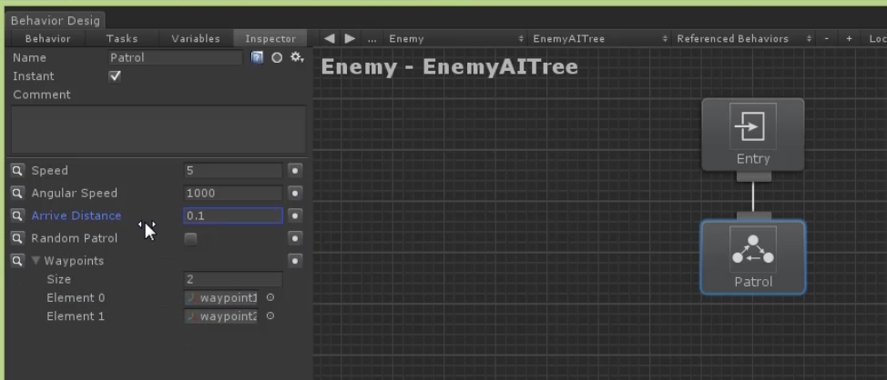
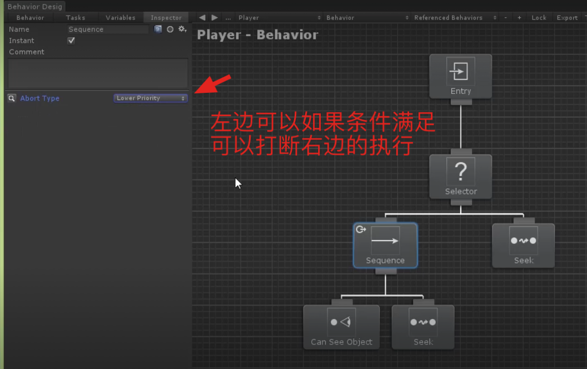
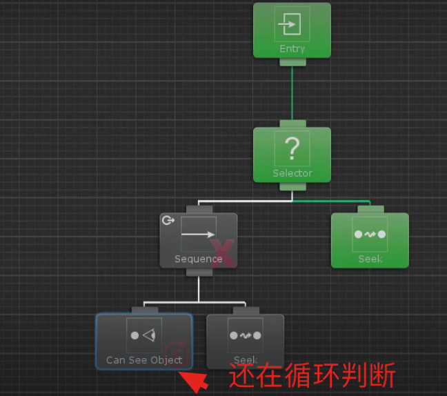
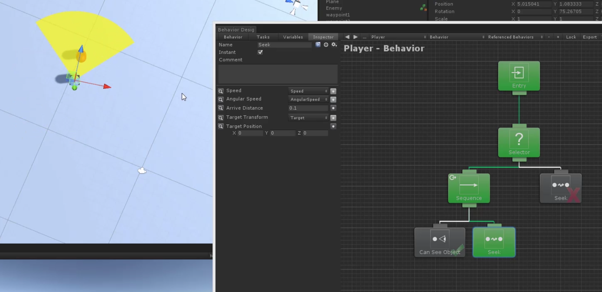
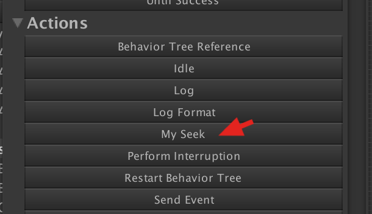
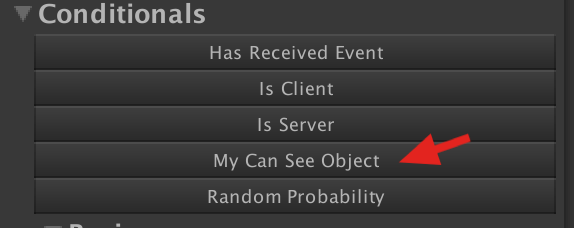
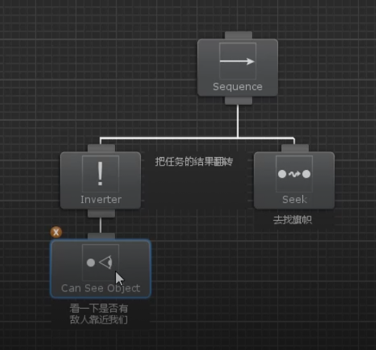
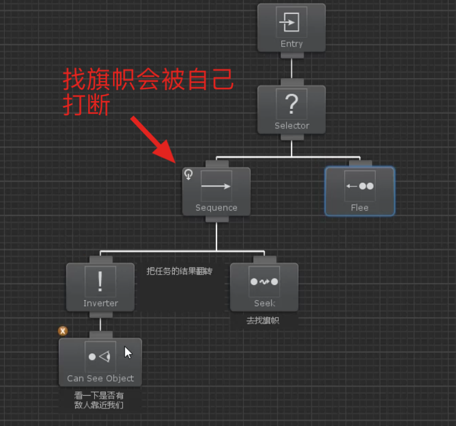

# Behavior Designer 使用
* Patrol 巡逻行为 基于NavMesh导航组件的行为

* 巡逻如果发现目标并跟随

AbortType:LowerPriority会终止比自己优先级低的行为



AbortType:Self会终止自身的运行
AbortType:Both两种情况都会判定，情况是Seek过程中看到敌人并追随，但敌人走的比较快，还会终端自身的Seek，继续右边的Seek。
* 自定义行为组件 MySeek
```
using BehaviorDesigner.Runtime.Tasks;
using UnityEngine;
// <summary>
// 控制游戏物体达到目标位置
// </summary>
public class MySeek : Action //任务的调用由Behavior Designer行为树控制的
{
    /// <summary>
    /// 要达到的目标位置
    /// </summary>
    public Transform Target;
    public float Speed;
    /// <summary>
    /// 到达目标位置的距离
    /// </summary>
    public float ArriveDistance = 0.1f;
    private float sqrArriveDistance;

    /// <summary>
    /// 每次重新进入的时候都会重新计算
    /// </summary>
    public override void OnStart()
    {
        sqrArriveDistance = ArriveDistance * ArriveDistance; 
    }

    ///当进入这个任务的时候，会一直调用这个方法，一直到任务结束 你返回一个成功或者失败状态 那么任务结束 如果返回一个running状态，那这个方法会一直继续调用
    public override TaskStatus OnUpdate()
    {
        if (Target == null)
            return TaskStatus.Failure;
        transform.LookAt(Target.position);
        transform.position = Vector3.MoveTowards(transform.position, Target.position, Speed * Time.deltaTime);
        //如果距离目标位置比较小则达到目标位置
        if ((Target.position - transform.position).sqrMagnitude < sqrArriveDistance)
        {
            return TaskStatus.Success;
        }
        return TaskStatus.Running;
    }
}
```

在行为组件里面会显示我们自定义的组件。
* 自定义条件组件 MyCanSeeObject
```
using BehaviorDesigner.Runtime;
using BehaviorDesigner.Runtime.Tasks;
using UnityEngine;
/// <summary>
/// 判断目标是否在视野内
/// </summary>
public class MyCanSeeObject : Conditional
{
    /// <summary>
    /// 判断是否在视野内的目标
    /// </summary>
    public Transform[] Targets;
    /// <summary>
    /// 视野的角度范围
    /// </summary>
    public float FieldOfViewAngle = 90f;
    /// <summary>
    /// 视野距离
    /// </summary>
    public float ViewDistance = 7f;
    /// <summary>
    /// 不需要赋值，这个是共享找到的目标
    /// </summary>
    public SharedTransform Target;
    public override TaskStatus OnUpdate()
    {
        if (Targets == null)
            return TaskStatus.Failure;
        foreach(var target in Targets)
        {
            float distance = (target.position - transform.position).magnitude;
            float angle = Vector3.Angle(transform.forward, target.position - transform.position);
            if (distance < ViewDistance && angle < FieldOfViewAngle * 0.5f)
            {
                this.Target.Value = target;
                return TaskStatus.Success;
            }
        }
        return TaskStatus.Failure;
    }
}
```

* 取反操作

* 远离行为
